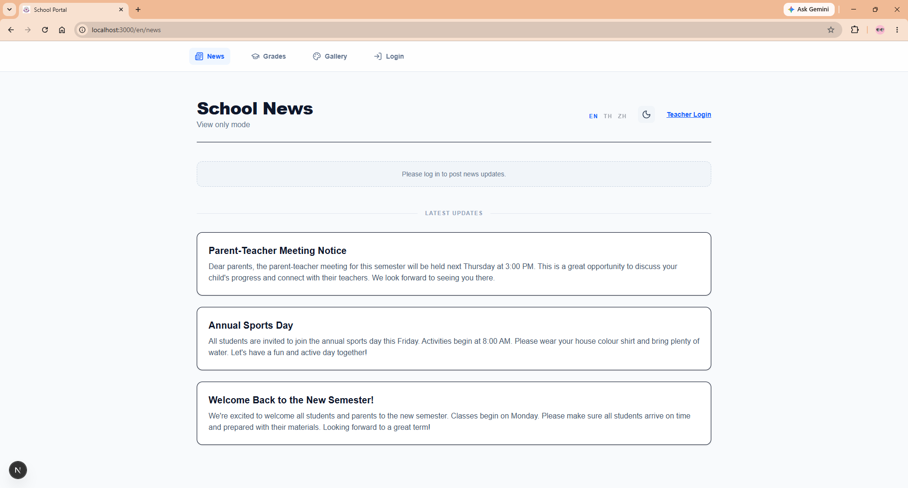

# School Portal

A full-stack school management web app built for real classroom use. Teachers can post news, manage student grades, and upload student artwork — all in three languages.

<p align="center">
  
</p>

## Features

- **News feed** — Post and manage school announcements. Public read access; teacher-only posting.
- **Gradebook** — Track student scores by subject, class level, and semester. Inline editing, auto-calculated letter grades, semester management.
- **Art gallery** — Display student artwork anonymously. Teachers can bulk-upload images.
- **Multilingual** — Full English, Thai, and Chinese support via dynamic `/[lang]/` routing. News posted in any language is automatically translated into all three languages simultaneously using Google Translate, so teachers only need to post once.
- **Dark mode** — System-aware theme toggle.
- **Role-based access** — Teacher login via Supabase Auth. Unauthenticated users get read-only views.

## Tech Stack

| Layer | Technology |
|---|---|
| Framework | Next.js 16 (App Router) |
| Language | TypeScript |
| Styling | Tailwind CSS v4 |
| Database & Auth | Supabase |
| Icons | Lucide React |
| Deployment | Vercel |

## Getting Started

### Prerequisites
- Node.js 18+
- A [Supabase](https://supabase.com) project with the following tables: `news`, `grades`, `semesters`, `student_art`

### Setup

1. Clone the repo and install dependencies:
   ```bash
   git clone https://github.com/your-username/school-website.git
   cd school-website
   npm install
   ```

2. Create a `.env.local` file in the project root:
   ```
   NEXT_PUBLIC_SUPABASE_URL=your_supabase_url
   NEXT_PUBLIC_SUPABASE_ANON_KEY=your_supabase_anon_key
   ```

3. Run the development server:
   ```bash
   npm run dev
   ```

Open [http://localhost:3000](http://localhost:3000) — it redirects to `/en/news` by default.

## Project Structure

```
src/
├── app/
│   ├── [lang]/         # Language-scoped routes (en / th / zh)
│   │   ├── news/       # News feed page
│   │   ├── grades/     # Gradebook (teacher only)
│   │   ├── gallery/    # Art gallery
│   │   └── login/      # Teacher login
│   └── actions/        # Server Actions (news, grades, gallery)
├── components/         # Reusable UI components
├── lib/
│   └── dictionaries.ts # All translations in one place
└── utils/
    ├── supabase/       # Supabase client helpers (server + client)
    └── gradeUtils.ts   # Shared grade letter calculation
```

## Supabase Schema

```sql
-- News posts
create table news (
  id uuid primary key default gen_random_uuid(),
  title text not null,
  content text not null,
  language text not null,  -- 'en' | 'th' | 'zh'
  created_at timestamptz default now()
);

-- Student grades
create table grades (
  id uuid primary key default gen_random_uuid(),
  student_name text not null,
  subject text not null,
  grade_level text not null,
  semester text not null,
  academic_year text,
  score numeric not null,
  grade_letter text not null,
  created_at timestamptz default now()
);

-- Semester periods
create table semesters (
  name text primary key,
  created_at timestamptz default now()
);

-- Student artwork
create table student_art (
  id uuid primary key default gen_random_uuid(),
  image_url text not null,
  created_at timestamptz default now()
);
```

## License

MIT
